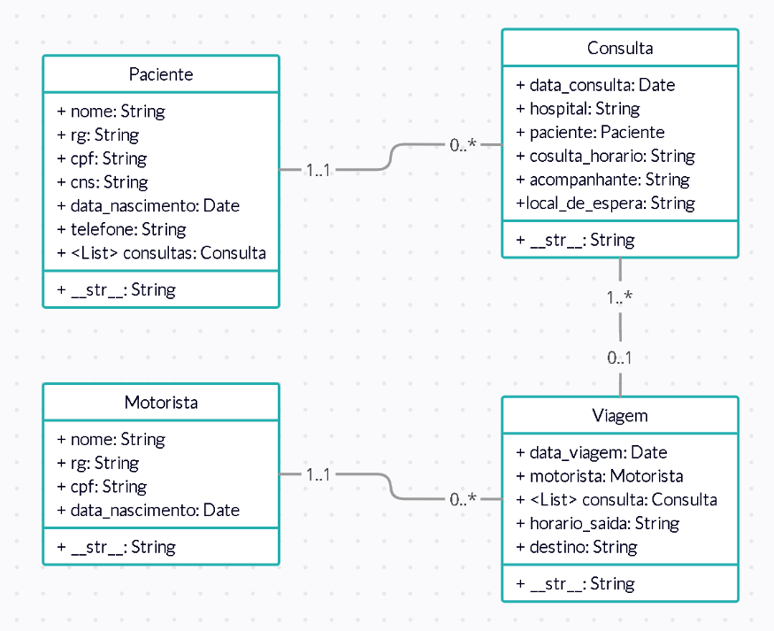

# DLogistica
Nesse repositório será desenvolvido um sistema de gerenciamento de pacientes e suas determinadas consultas.

## Diagrama



## Objetivos

### Prioridade/Obrigatório
- (V) Criação do models;
- (V) Criar template base;
- (V) Implementar listagem de Paciente;
- (X) Desenvolver o CRUD para Paciente;
- (V) Implementar a visualização dos detalhes de Paciente;
- (V) Implementar CRUD de Consulta;
- (V) Implementar a listagem de todas as Consultas;
- (V) Implementar a visualização dos detalhes da Consulta;
- (V) Adicionar a Paciente-Detalhes a visualização de todas as consultas;
- (V) Implementar Paginação na listagem de Pacientes e Consulta;
- (V) Implemetar método de pesquisa por campos;

### Features Adicionais
- (X) Implementar o CRUD para Viagem;
- (X) Implementar a visualização de todas as viagem;
- (X) Implementar os detalhes de cada viagem;
- (X) Adicionar em viagem-detalhes todas as Consultas;

# Instalando projeto

Utilize os códigos abaixo na linha de comando adaptando para seu sistema:

```
git clone https://github.com/BPerdona/dLogistica.git
```

```
cd <caminho da pasta após extrair>
```

```
python -m venv <nome da sua venv>
```

```
python -m pip install --upgrade pip
```

```
pip install -r requirements.txt
```

```
*Crie o arquivo local_settings.py junto com o arquivo settings.py, adicione nele o DEBUG = True, sua SECRET_KEY e a configuração do seu banco de dados*
```

```
python manage.py collectstatic
```

```
python manage.py migrate
```

## Para iniciar o servidor local

```
python3 manage.py runserver
```

